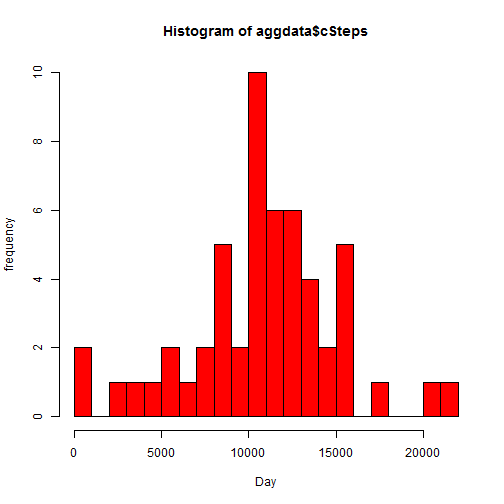
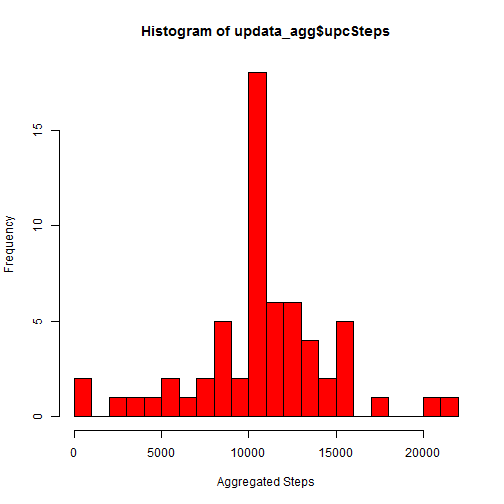
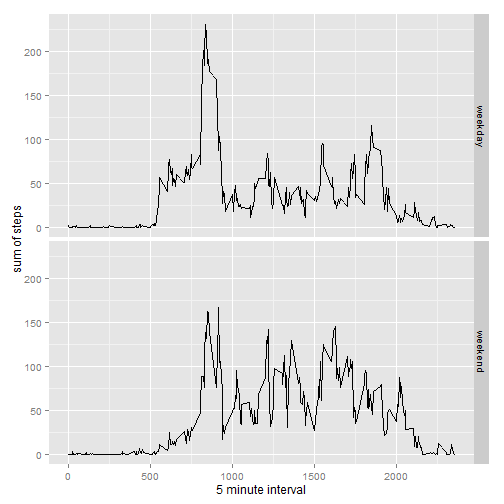

Activity Monitoring data
========================

1. Load data into R studio


```r
data <- read.csv(file = "activity.csv", header = TRUE, sep = ",")
View(data)
```

2. Number of steps per day

Aggregate number of steps taken per day

```r
data$Day <- as.list(data$date)
data$Day <- as.numeric(data$Day)

aggdata <- aggregate(data$steps , list(day = data$Day), sum)
colnames(aggdata)[colnames(aggdata)=="x"] <- "cSteps"
```

Make a histogram of the number of steps taken per day


```r
hist(x = aggdata$cSteps, breaks = 20, col = "red", xlab = "Day", ylab = "frequency")
```

 

Calculate the mean and median of the steps


```r
mean(aggdata$cSteps, na.rm = TRUE)
```

```
## [1] 10766.19
```

```r
median(aggdata$cSteps, na.rm = TRUE)
```

```
## [1] 10765
```

3. Obtain average acitivty pattern


```r
mean_si <- aggregate(list(steps = data$steps), list(interval = data$interval), mean, na.rm = TRUE)

library(ggplot2)
ggplot(data = mean_si, aes(x = interval, y = steps)) + geom_line() + xlab("5-minute interval") + 
    ylab("average number of steps taken")
```

 

Obtain the maximum average acitivty pattern


```r
mean_si[which.max(mean_si$steps),]
```

```
##     interval    steps
## 104      835 206.1698
```

4. Inputting missing values

Calculate and report the number of missing values/NAs in the dataset

```r
data$missing <- is.na(data$steps)
table(data$missing)
```

```
## 
## FALSE  TRUE 
## 15264  2304
```

Replace missing values with mean of 5 min interval


```r
for (i in 1:nrow(data)) {
  if (data$missing[i] == TRUE) {
    for (r in 1:nrow(mean_si)) { 
      if (mean_si$interval[r] == data$interval[i]) {
        data$steps[i] = mean_si$steps[r]
        break
      }
    }
  }
}
```

create a new dataset that follows the strategy above, make a histogram of the number of steps taken
each day, and report the mean and median of the new dataset.


```r
updata <- data

updata_agg <- aggregate(updata$steps , list(day = updata$Day), sum)
colnames(updata_agg)[colnames(updata_agg)=="x"] <- "upcSteps"


hist(x = updata_agg$upcSteps, breaks = 20, col = "red", xlab = "Aggregated Steps")
```

 

```r
mean(updata_agg$upcSteps, na.rm = TRUE)
```

```
## [1] 10766.19
```

```r
median(updata_agg$upcSteps, na.rm = TRUE)
```

```
## [1] 10766.19
```

As can be observed, there was barely any impact on replacing the missing values with the mean of the 
5 min intervals, suggesting that we can use the updated dataset for further analysis.

5. Weekday and Weekend; Compare and Contrast

Factor out the weekday and end in the dataset

```r
updata$date <- as.Date(updata$date)
class(updata$date)
```

```
## [1] "Date"
```

```r
updata$weekday <- weekdays(updata$date)


for (i in 1:nrow(updata)){
  if (updata$weekday[i] == "Saturday" | updata$weekday[i] == "Sunday"){
    updata$weekday[i] = "weekend"} 
  else {
    updata$weekday[i] = "weekday"   
    }
}

updata$weekday <- as.factor(updata$weekday)
str(updata)
```

```
## 'data.frame':	17568 obs. of  6 variables:
##  $ steps   : num  1.717 0.3396 0.1321 0.1509 0.0755 ...
##  $ date    : Date, format: "2012-10-01" "2012-10-01" ...
##  $ interval: int  0 5 10 15 20 25 30 35 40 45 ...
##  $ Day     : num  1 1 1 1 1 1 1 1 1 1 ...
##  $ missing : logi  TRUE TRUE TRUE TRUE TRUE TRUE ...
##  $ weekday : Factor w/ 2 levels "weekday","weekend": 1 1 1 1 1 1 1 1 1 1 ...
```

Create a plot that can compare the number of steps taken per 5 min interval for weekday vs weekend


```r
aggupdata <- aggregate(steps ~ interval + weekday, data = updata, mean)

ggplot(aggupdata, aes(interval, steps)) + geom_line() + facet_grid(weekday ~ .) + 
    xlab("5 minute interval") + ylab("sum of steps")
```

 
